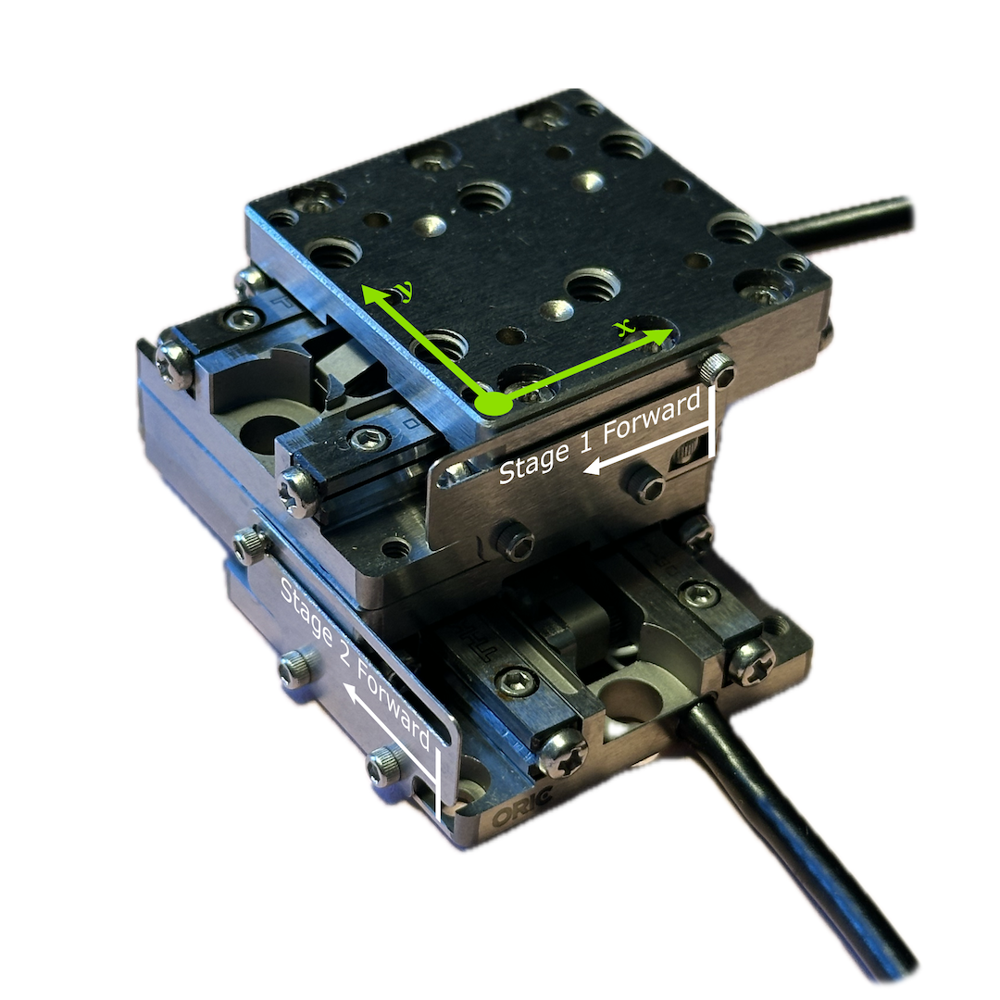

# Piezo Inertial Drive Stage Scanning Autosequences

This repository contains MATLAB code autosequences used to control the Piezoelectric Inertial Drive Stages
made by Thorlabs.

## Repository File Structure
- `KIM101_GUIDE.m` This is the original code provided by Thorlabs to demonstrate MATLAB implementation of the API
- `IDS_Scanning.m` This file contains the main autosequence that scans across the surface of a stage in an XY configuration
- `testing.m`      A sandbox file for testing purposes
- `Documentation/` This directory has documentation PDFs from Thorlabs about the relevant components.

## Hysteresis
The piezoelectric inertial drive stages exhibit different behaviors moving backward and forward. Forward motion
is more easily achieved by the Thorlabs PD stages and thus when moving in reverse a larger cycle count is necessary
to match an equal forward motion. This value can change depending on load configuration. Therefore the
appropriate jog step counts must be updated in the autosequence.

## Movement

Movement of the stage is open-loop control when run without limit switches or other sensors.
The range of motion in the forward direction is about `7200` steps.
The range of motion in the reverse direction is about `15400` steps.

## Dependencies & Resources
The code in this repo uses the .NET objects and methods defined in Thorlabs' Kinesis DLLs provided for free
available on their [website](https://www.thorlabs.com/software_pages/ViewSoftwarePage.cfm?Code=Motion_Control&viewtab=0).

Within the Kinesis installation directory (default is `C:\Program Files\Thorlabs\Kinesis`) there are two 
compiled HTML help files available for assistance with using the APIs:
- `Thorlabs.MotionControl.DotNet_API.chm` For help with the .NET API
- `Thorlabs.MotionControl.C_API.chm` For help with the C API
